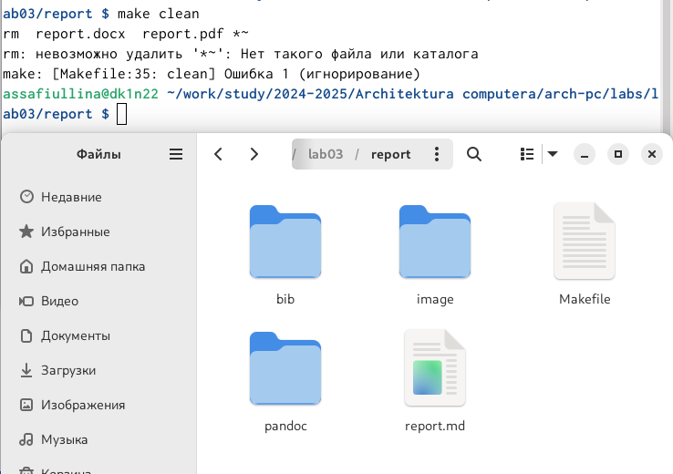

---
## Front matter
title: "Отчёт по лабораторной работе №3"
subtitle: "Архитектура компьютера"
author: "Сафиуллина Айлина Саяровна"

## Generic otions
lang: ru-RU
toc-title: "Содержание"

## Bibliography
bibliography: bib/cite.bib
csl: pandoc/csl/gost-r-7-0-5-2008-numeric.csl

## Pdf output format
toc: true # Table of contents
toc-depth: 2
lof: true # List of figures
lot: true # List of tables
fontsize: 12pt
linestretch: 1.5
papersize: a4
documentclass: scrreprt
## I18n polyglossia
polyglossia-lang:
  name: russian
  options:
	- spelling=modern
	- babelshorthands=true
polyglossia-otherlangs:
  name: english
## I18n babel
babel-lang: russian
babel-otherlangs: english
## Fonts
mainfont: IBM Plex Serif
romanfont: IBM Plex Serif
sansfont: IBM Plex Sans
monofont: IBM Plex Mono
mathfont: STIX Two Math
mainfontoptions: Ligatures=Common,Ligatures=TeX,Scale=0.94
romanfontoptions: Ligatures=Common,Ligatures=TeX,Scale=0.94
sansfontoptions: Ligatures=Common,Ligatures=TeX,Scale=MatchLowercase,Scale=0.94
monofontoptions: Scale=MatchLowercase,Scale=0.94,FakeStretch=0.9
mathfontoptions:
## Biblatex
biblatex: true
biblio-style: "gost-numeric"
biblatexoptions:
  - parentracker=true
  - backend=biber
  - hyperref=auto
  - language=auto
  - autolang=other*
  - citestyle=gost-numeric
## Pandoc-crossref LaTeX customization
figureTitle: "Рис."
tableTitle: "Таблица"
listingTitle: "Листинг"
lofTitle: "Список иллюстраций"
lotTitle: "Список таблиц"
lolTitle: "Листинги"
## Misc options
indent: true
header-includes:
  - \usepackage{indentfirst}
  - \usepackage{float} # keep figures where there are in the text
  - \floatplacement{figure}{H} # keep figures where there are in the text
---

# Цель работы

Овладеть процессом оформления отчетов с использованием простого языка разметки Markdown.

# Выполнение лабораторной работы

Установила Pandoc и TexLive по инструкции из лабораторной работы.
Открыла через каталог лабораторной работы №3 терминал. Затем выполнила компиляцию шаблона с использованием Makefile. Для этого ввела команду make.(рис. [-@fig:001]).

{#fig:001 width=100%}

Для скорости компиляции файла, через текстовый редактор mc открываем Makefile и меняем команду lualatex на xelatex.(рис. [-@fig:002]).

{#fig:002 width=100%}

Открываем домашнюю папку и проверяем наличие созданных файлов.(рис. [-@fig:003]).

{#fig:003 width=100%}

Удалила полученные файлы с использованием Makefile. Для этого ввела команду make clean.(рис. [-@fig:004]).

{#fig:004 width=100%}

Далее в терминале ввела команду gedit report.md, при помощи которой открылся шаблон отчета лабораторной работы (рис. [-@fig:005]).

{#fig:005 width=100%}

(рис. [-@fig:006]).

{#fig:006 width=100%}

(рис. [-@fig:007]).

{#fig:007 width=100%}

Далее я начала заполнять отчет(рис. [-@fig:008]).

{#fig:008 width=100%}

После завершения написания отчета с помощью команды make скомпилировала 2 файла - docx и pdf. Далее выгрузила все материалы выполнения лабораторной работы №3 в свой репозиторий на github с помощью следующих команд:

dit add .
git commit -am 'feat(main): add files lab-3'
git push

# Выводы

Здесь кратко описываются итоги проделанной работы.

