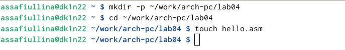
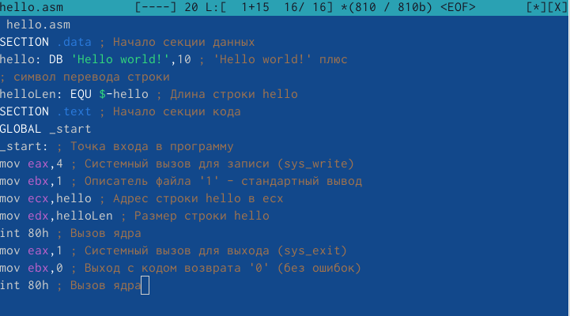
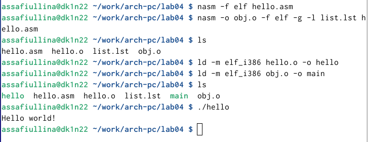
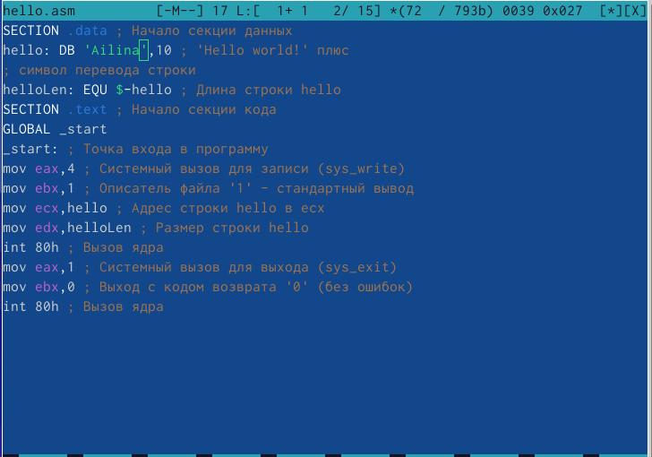
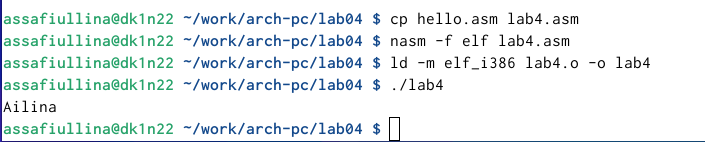

---
## Front matter
title: "Отчет по лабораторной работе №4"
subtitle: "Архитектура компьютера"
author: "Сафиуллина Айлина Саяровна"

## Generic otions
lang: ru-RU
toc-title: "Содержание"

## Bibliography
bibliography: bib/cite.bib
csl: pandoc/csl/gost-r-7-0-5-2008-numeric.csl

## Pdf output format
toc: true # Table of contents
toc-depth: 2
lof: true # List of figures
lot: true # List of tables
fontsize: 12pt
linestretch: 1.5
papersize: a4
documentclass: scrreprt
## I18n polyglossia
polyglossia-lang:
  name: russian
  options:
	- spelling=modern
	- babelshorthands=true
polyglossia-otherlangs:
  name: english
## I18n babel
babel-lang: russian
babel-otherlangs: english
## Fonts
mainfont: IBM Plex Serif
romanfont: IBM Plex Serif
sansfont: IBM Plex Sans
monofont: IBM Plex Mono
mathfont: STIX Two Math
mainfontoptions: Ligatures=Common,Ligatures=TeX,Scale=0.94
romanfontoptions: Ligatures=Common,Ligatures=TeX,Scale=0.94
sansfontoptions: Ligatures=Common,Ligatures=TeX,Scale=MatchLowercase,Scale=0.94
monofontoptions: Scale=MatchLowercase,Scale=0.94,FakeStretch=0.9
mathfontoptions:
## Biblatex
biblatex: true
biblio-style: "gost-numeric"
biblatexoptions:
  - parentracker=true
  - backend=biber
  - hyperref=auto
  - language=auto
  - autolang=other*
  - citestyle=gost-numeric
## Pandoc-crossref LaTeX customization
figureTitle: "Рис."
tableTitle: "Таблица"
listingTitle: "Листинг"
lofTitle: "Список иллюстраций"
lotTitle: "Список таблиц"
lolTitle: "Листинги"
## Misc options
indent: true
header-includes:
  - \usepackage{indentfirst}
  - \usepackage{float} # keep figures where there are in the text
  - \floatplacement{figure}{H} # keep figures where there are in the text
---

# Цель работы

Освоение процедуры компиляции и сборки программ, написанных на ассемблере NASM.

# Теоретическое введение

Основными функциональными элементами любой электронно-вычислительной машины (ЭВМ) являются центральный процессор, память и периферийные устройства. Взаимодействие этих устройств осуществляется через общую шину, к которой они подключены. Физически шина представляет собой большое количество проводников, соединяющих устройства друг с другом. В современных компьютерах проводники выполнены в виде электропроводящих дорожек на материнской (системной) плате.
Основной задачей процессора является обработка информации, а также организация координации всех узлов компьютера. В состав центрального процессора (ЦП) входят следующие устройства:
• арифметико-логическое устройство (АЛУ) — выполняет логические и арифметические действия, необходимые для обработки информации, хранящейся в памяти;
• устройство управления (УУ) — обеспечивает управление и контроль всех устройств компьютера;
• регистры — сверхбыстрая оперативная память небольшого объёма, входящая в состав процессора, для временного хранения промежуточных результатов выполнения
инструкций; регистры процессора делятся на два типа: регистры общего назначения и специальные регистры.

# Выполнение лабораторной работы

С помощью команды mkdir я создала каталог lab04, затем перешла в него с помощью команды cd и создала файл hello.asm. (рис. [-@fig:001]).

{#fig:001 width=100%}

С помощью команды mc открыла созданный файл и внесла в него текст листинга из лабораторной работы. (рис. [-@fig:002]).

{#fig:002 width=100%}

При помощи команды nasm я выполнила трансляцию файла. В результате был создан объектный файл hello.o.
После повторно выполнила трансляцию с использованием дополнительных опций команды nasm. В результате этой операции были созданы файл листинга list.lst, объектный файл obj.o, и в программу была добавлена отладочная информация.
При помощи команды ld я выполнила линковку и получила исполняемый файл.
Повторно выполнила линковку для объектного файла obj.o и получила исполняемый файл с именем main.
После этого запустила оба исполняемых файла и проверила их работу.(рис. [-@fig:003]).

{#fig:003 width=100%}

Для выполнения задания я изменила текст сообщения "Hello world" на свое имя (рис. [-@fig:004]).

{#fig:004 width=100%}

После изменения текста я снова запустила программу и получила корректный результат. (рис. [-@fig:005]).

{#fig:005 width=100%}

# Выводы

В ходе выполнения данной лабораторной работы я освоила процесс компиляции и сборки программ на ассемблере NASM, научилась трансляции, линковке и добавлению отладочной информации. А еще изменила код программы для вывода своего имени в соответствии с заданием для самостоятельной работы.

