---
## Front matter
title: "Отчёт по лабораторной работе №5"
subtitle: "Дисциплина: Архитектура компьютера"
author: "Айлина Сафиуллина"

## Generic otions
lang: ru-RU
toc-title: "Содержание"

## Bibliography
bibliography: bib/cite.bib
csl: pandoc/csl/gost-r-7-0-5-2008-numeric.csl

## Pdf output format
toc: true # Table of contents
toc-depth: 2
lof: true # List of figures
fontsize: 12pt
linestretch: 1.5
papersize: a4
documentclass: scrreprt
## I18n polyglossia
polyglossia-lang:
  name: russian
  options:
	- spelling=modern
	- babelshorthands=true
polyglossia-otherlangs:
  name: english
## I18n babel
babel-lang: russian
babel-otherlangs: english
## Fonts
mainfont: IBM Plex Serif
romanfont: IBM Plex Serif
sansfont: IBM Plex Sans
monofont: IBM Plex Mono
mathfont: STIX Two Math
mainfontoptions: Ligatures=Common,Ligatures=TeX,Scale=0.94
romanfontoptions: Ligatures=Common,Ligatures=TeX,Scale=0.94
sansfontoptions: Ligatures=Common,Ligatures=TeX,Scale=MatchLowercase,Scale=0.94
monofontoptions: Scale=MatchLowercase,Scale=0.94,FakeStretch=0.9
mathfontoptions:
## Biblatex
biblatex: true
biblio-style: "gost-numeric"
biblatexoptions:
  - parentracker=true
  - backend=biber
  - hyperref=auto
  - language=auto
  - autolang=other*
  - citestyle=gost-numeric
## Pandoc-crossref LaTeX customization
figureTitle: "Рис."
tableTitle: "Таблица"
listingTitle: "Листинг"
lofTitle: "Список иллюстраций"
lotTitle: "Список таблиц"
lolTitle: "Листинги"
## Misc options
indent: true
header-includes:
  - \usepackage{indentfirst}
  - \usepackage{float} # keep figures where there are in the text
  - \floatplacement{figure}{H} # keep figures where there are in the text
---

# Цель работы

Приобретение практических навыков работы в Midnight Commander. Освоение инструкций
языка ассемблера mov и int.

# Задание

1. Основы работы с Midnight Commander

2. Структура программы на языке ассемблера NASM

3. Подключение внешнего файла 

4. Выполнение заданий для самостоятельной работы

# Выполнение лабораторной работы

1. Открываем Midnight Commander

 assafiullina@dk3n33:~$ mc (рис. [-@fig:001]).
 
с помощью клавиш стрелка вверх,стрелка вниз и Enter переходим в каталог ~/work/arch-pc

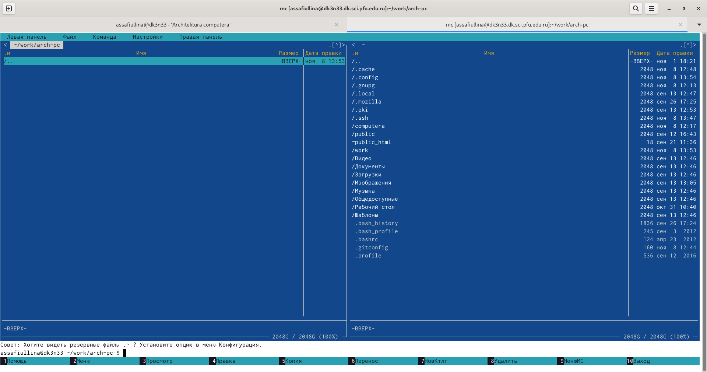{#fig:001 width=70%}

с помощью функциональной клавиши F7 создадим папку lab05 и перейдем в созданный каталог (рис. [-@fig:002])

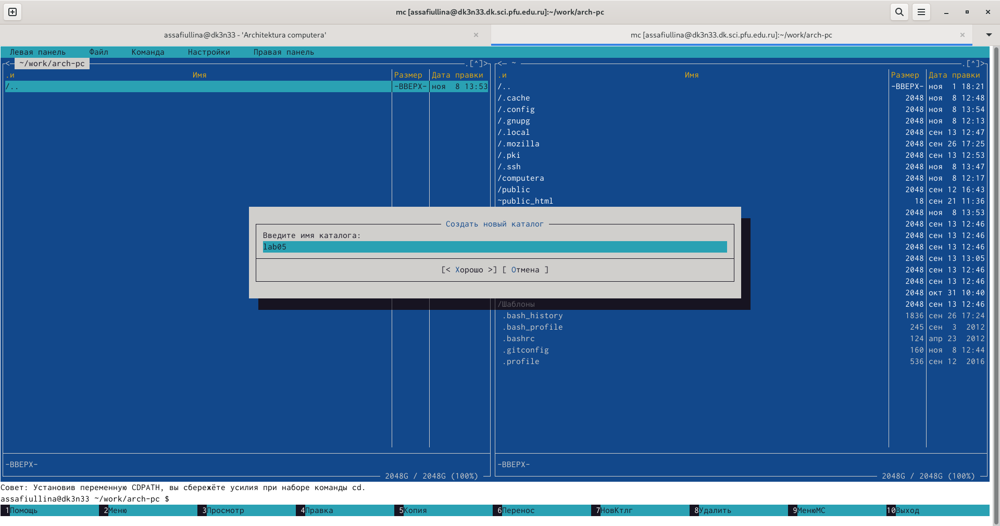{#fig:002 width=70%}

пользуясь строкой ввода и командой touch(рис. [-@fig:004]) создаем файл lab5-1.asm (рис. [-@fig:003])

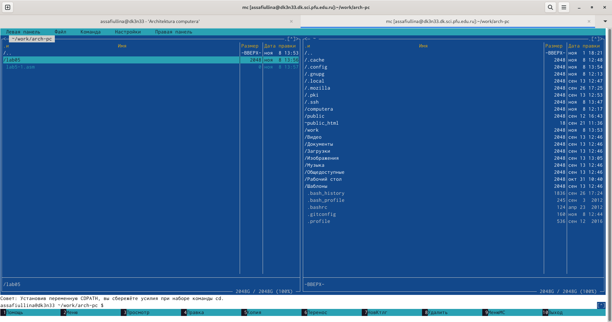{#fig:003 width=70%}

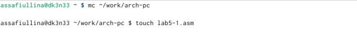{#fig:004 width=70%}

с помощью функциональной клавиши F4 открываем файл lab5-1.asm для редактирования во встроенном редакторе Midnight Commander и вводим текст программы из листинга 5.1 (рис. [-@fig:005])

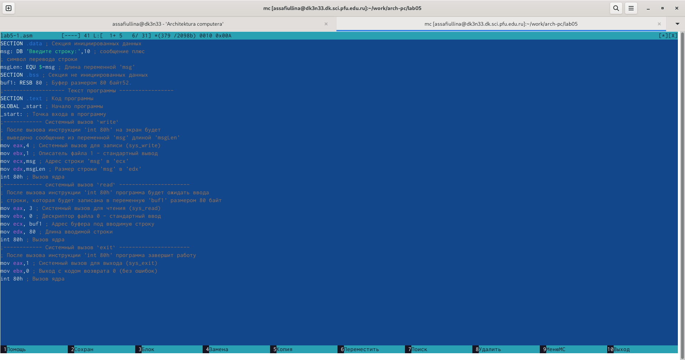{#fig:005 width=70%}

с помощью функциональной клавиши F3 открываем файл lab5-1.asm для просмотра и проверяем, что файл содержит текст программы.

2. Структура программы на языке ассемблера NASM 

оттранслируем текст программы lab5-1.asm в объектный файл. Выполняем компановку объектного файла и запускаем получившийся в исполняемый файл. Программа выводит строку "Введите строку:" и ожидает ввода с клавиатуры. (рис. [-@fig:006])

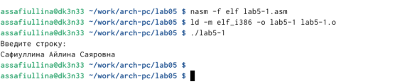{#fig:006 width=70%}

3. Подключение внешнего файла in_out.asm

скачиваем файл in_out.asm со страницы курса в ТУИС (рис. [-@fig:007])

{#fig:007 width=70%}

в одной из панелей mc открываем каталог с файлом lab5-1.asm. в другой панели каталог со скаченным файлом in_out.asm, копируем файл in_out.asm в каталог с файлом lab5-1.asm с помощью функциональной клавиши F5

далее создаем копию файла lab5-1.asm с именем lab5-2.asm (рис. [-@fig:008])

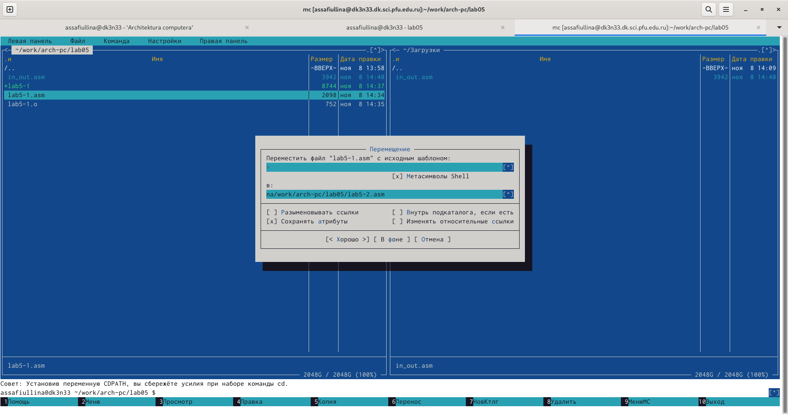{#fig:008 width=70%}

исправляем текст программы в файле lab5-2.asm с использованием подпрограмм из внешнего файла in_out.asm в соответствии с листингом 5.2. (рис. [-@fig:009])

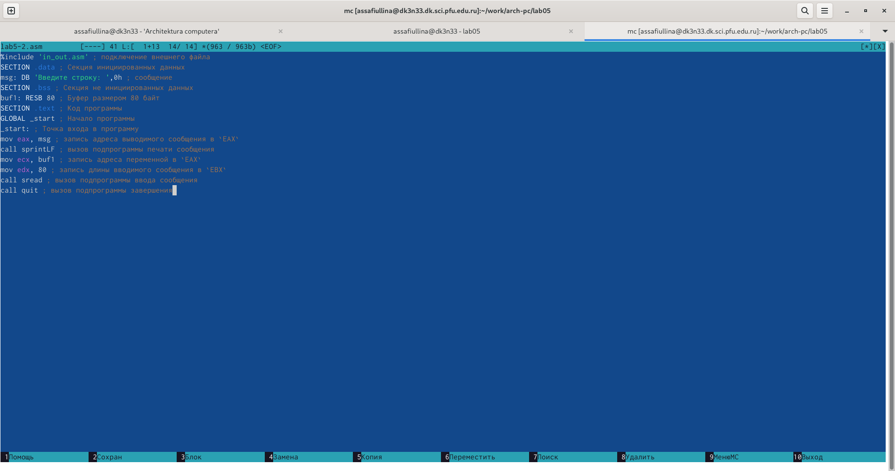{#fig:009 width=70%}

создаем исполняемый файл и проверяем его работу. (рис. [-@fig:010])

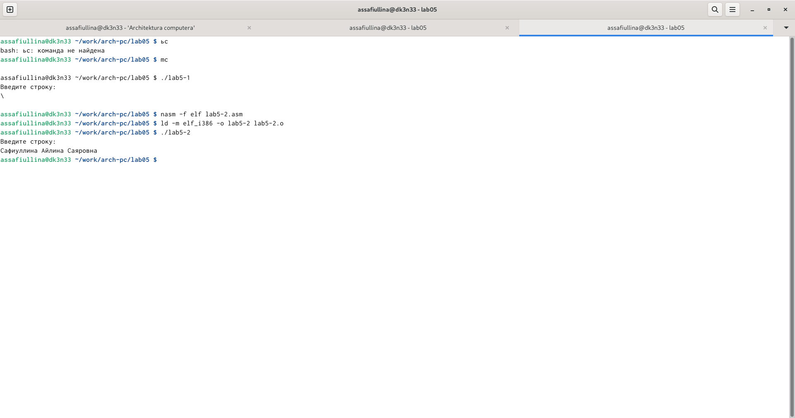{#fig:010 width=70%}

в файле lab5-2.asm заменим подпрограмму sprintLF на sprint(рис. [-@fig:011])

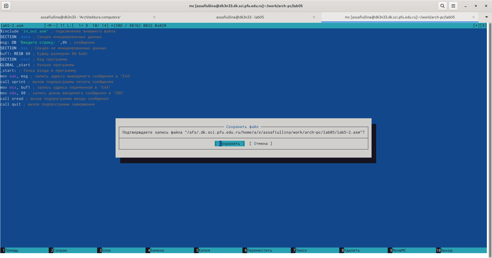{#fig:011 width=70%}

заменив команду sprintLF на sprint, мы можем заметить изменение: ввод начинается с той же строки, а не с новой.(рис. [-@fig:012])

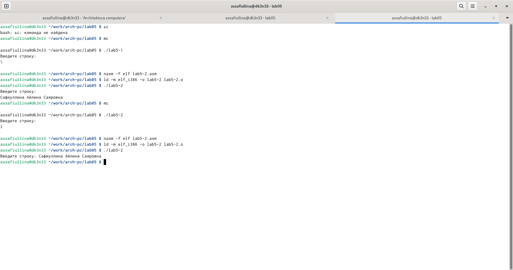{#fig:012 width=70%}

4. Задание для самостоятельной работы.

создадим копию файла lab5-1.asm. Внесем изменения в программу так, чтобы она работала по следующему алгоритму:

- вывести приглашение типа "Введите строку:";
- ввести строку с клавиатуры;
- вывести введенную строку на экран.

(рис. [-@fig:013])

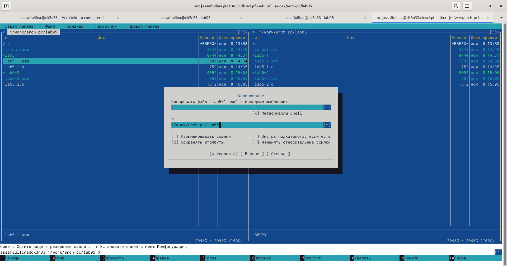{#fig:013 width=70%}

(рис. [-@fig:014])

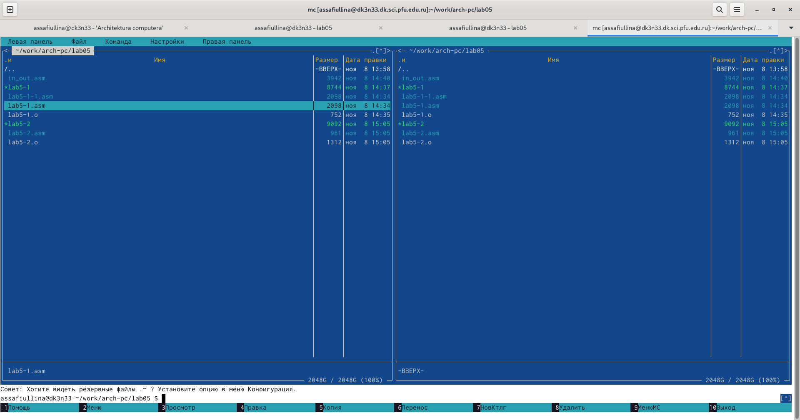{#fig:014 width=70%}

получим исполняемый файл и проверим его работу. на приглашение ввести строку введем свое ФИО

(рис. [-@fig:015])

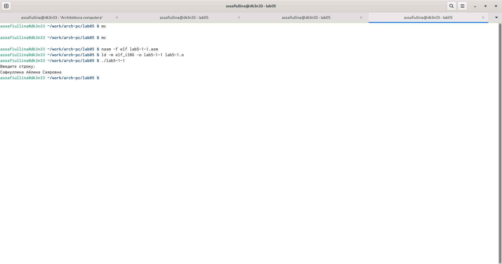{#fig:015 width=70%}

создадим копию файла lab5-2.asm. Внесем изменения в программу так, чтобы она работала по следующему алгоритму:

- вывести приглашение типа "Введите строку:";
- ввести строку с клавиатуры;
- вывести введенную строку на экран.

(рис. [-@fig:016])

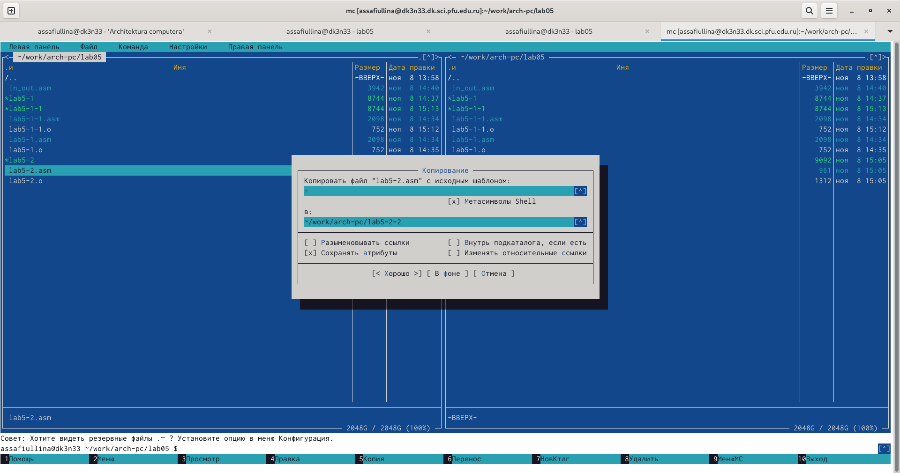{#fig:016 width=70%}

(рис. [-@fig:017])

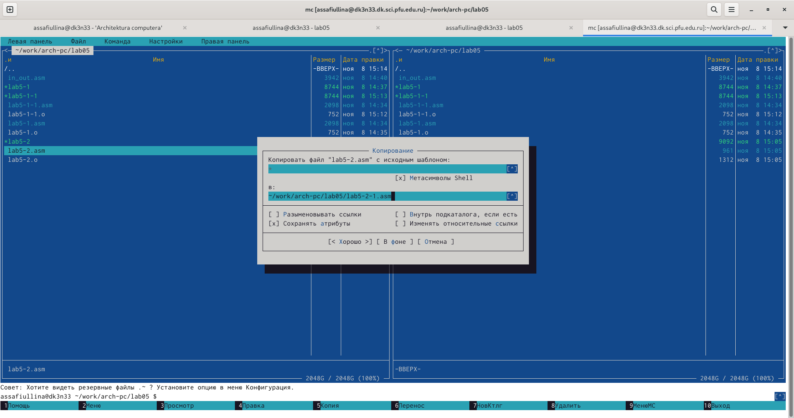{#fig:017 width=70%}

получим исполняемый файл и проверим его работу. на приглашение ввести строку введем свое ФИО

(рис. [-@fig:018])

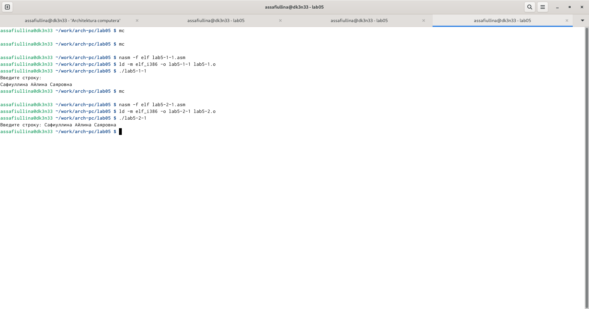{#fig:018 width=70%}

# Выводы
При выполнении данной лабороторной работы мы приобрели навыки практической работы в Midnight Commander, освоили инструкции языка ассемблера mov и int, а также выполнили самостоятельную работу.

