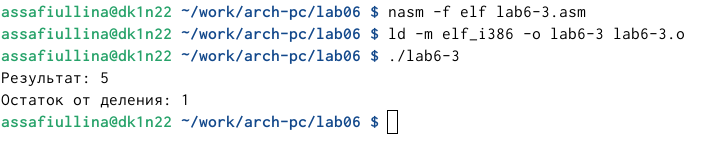

---
## Front matter
title: "Отчёт по лабораторной работе №6"
subtitle: "Архитектура компьютера"
author: "Сафиуллина Айлина Саяровна"

## Generic otions
lang: ru-RU
toc-title: "Содержание"

## Bibliography
bibliography: bib/cite.bib
csl: pandoc/csl/gost-r-7-0-5-2008-numeric.csl

## Pdf output format
toc: true # Table of contents
toc-depth: 2
lof: true # List of figures
lot: true # List of tables
fontsize: 12pt
linestretch: 1.5
papersize: a4
documentclass: scrreprt
## I18n polyglossia
polyglossia-lang:
  name: russian
  options:
	- spelling=modern
	- babelshorthands=true
polyglossia-otherlangs:
  name: english
## I18n babel
babel-lang: russian
babel-otherlangs: english
## Fonts
mainfont: IBM Plex Serif
romanfont: IBM Plex Serif
sansfont: IBM Plex Sans
monofont: IBM Plex Mono
mathfont: STIX Two Math
mainfontoptions: Ligatures=Common,Ligatures=TeX,Scale=0.94
romanfontoptions: Ligatures=Common,Ligatures=TeX,Scale=0.94
sansfontoptions: Ligatures=Common,Ligatures=TeX,Scale=MatchLowercase,Scale=0.94
monofontoptions: Scale=MatchLowercase,Scale=0.94,FakeStretch=0.9
mathfontoptions:
## Biblatex
biblatex: true
biblio-style: "gost-numeric"
biblatexoptions:
  - parentracker=true
  - backend=biber
  - hyperref=auto
  - language=auto
  - autolang=other*
  - citestyle=gost-numeric
## Pandoc-crossref LaTeX customization
figureTitle: "Рис."
tableTitle: "Таблица"
listingTitle: "Листинг"
lofTitle: "Список иллюстраций"
lotTitle: "Список таблиц"
lolTitle: "Листинги"
## Misc options
indent: true
header-includes:
  - \usepackage{indentfirst}
  - \usepackage{float} # keep figures where there are in the text
  - \floatplacement{figure}{H} # keep figures where there are in the text
---

# Цель работы

Целью работы является освоение арифметических инструкций языка ассемблера NASM.

# Задание

1. Символьные и численные данные в NASM.
2. Выполнение арифметических операций в NASM.
3. Выполнение задания для самостоятельной работы.

# Выполнение лабораторной работы

Я создала каталог для программ лабораторной работы № 6, перешла в него и создала файл lab6-1.asm. (рис. [-@fig:001]).

{#fig:001 width=100%}

Вводим в файл lab6-1.asm текст программы из листинга 6.1 (рис. [-@fig:002]).

{#fig:002 width=100%}

Создадим исполняемый файл и проверим его работу (рис. [-@fig:003]).

{#fig:003 width=100%}

Изменяю текст программы, вместо символов записывая в eax, ebx числа (рис. [-@fig:004]).

{#fig:004 width=100%}

Создадим исполняемый файл и проверим его работу (рис. [-@fig:005]).

{#fig:005 width=100%}

На экране ничего не отображается. Это связано с тем, что символ с кодом 10 -
это символ перевода строки

Создаю файл lab6-2.asm в каталоге для программ лабораторной №6. Ввожу в
него текст программы из листинга 6.2 (рис. [-@fig:006]).

{#fig:006 width=100%}

Создадим исполняемый файл и проверим его работу (рис. [-@fig:007]).

{#fig:007 width=100%}

Аналогично предыдущей программе заменяю символы на числа, затем снова создаю исполняемый файл и получаю результат арифметической операции (рис. [-@fig:008]).

{#fig:008 width=100%}

Заменяю функцию iprintLF на iprint (рис. [-@fig:009]).

{#fig:009 width=100%}

Создадим исполняемый файл и проверим его работу (рис. [-@fig:010]).

{#fig:010 width=100%}

Вывод функции iprintLF от вывода функции iprint отличается тем, что в последнем случае после вывода не добавляется переход на новую строку

С помощью функции touch создаю файл lab6-3.asm. Ввожу в него текст программы для вычисления значения указанного выражения (рис. [-@fig:011]).

{#fig:011 width=100%}

Создадим исполняемый файл и проверим его работу (рис. [-@fig:012]).

{#fig:012 width=100%}

Изменяю текст программы для вычисления нового выражения (рис. [-@fig:013]).

{#fig:013 width=100%}

Создадим исполняемый файл и проверим его работу (рис. [-@fig:014]).

{#fig:014 width=100%}

С помощью функции touch создаю файл variant.asm. Ввожу в него текст программы для вычисления варианта (рис. [-@fig:015]).

{#fig:015 width=100%}

Создадим исполняемый файл и проверим его работу (рис. [-@fig:016]).

{#fig:016 width=100%}

мой вариант - 12.

В соответствии с вариантом выполним задание для самостоятельной работы (рис. [-@fig:017]).

{#fig:017 width=100%}

(рис. [-@fig:018]).

{#fig:018 width=100%}

Ответы на вопросы:
    1. Какие строки листинга отвечают за вывод на экран сообщения ‘Ваш вариант:’?
    • Строка “mov eax, rem” перекладывает в регистр значение переменной с фразой “Ваш вариант:”.
Строка “call sprint” вызывает подпрограмму вывода строки.
    2. Для чего используются следующие инструкции?
    • Инструкция “nasm” используется для компиляции кода на языке ассемблера NASM.
Инструкция “mov ecx, x” используется для перемещения значения переменной x в регистр ecx.
Инструкция “mov edx, 80” используется для перемещения значения 80 в регистр edx.
Инструкция “call sread” вызывает подпрограмму для считывания значения студенческого билета из консоли.
    3. Для чего используется инструкция “call atoi”?
    • Инструкция “call atoi” используется для преобразования введенных символов в числовой формат.
    4. Какие строки листинга отвечают за вычисления варианта?
    • Строка “xor edx, edx” обнуляет регистр edx.
Строка “mov ebx, 20” записывает значение 20 в регистр ebx.
Строка “div ebx” выполняет деление номера студенческого билета на 20.
Строка “inc edx” увеличивает значение регистра edx на 1.
    5. В какой регистр записывается остаток от деления при выполнении инструкции “div ebx”?
    • Остаток от деления записывается в регистр edx.
    6. Для чего используется инструкция “inc edx”?
    • Инструкция “inc edx” используется для увеличения значения в регистре edx на 1, в соответствии с формулой вычисления варианта.
    7. Какие строки листинга отвечают за вывод на экран результата вычислений?
    • Строка “mov eax, edx” перекладывает результат вычислений в регистр eax.
Строка “call iprintLF” вызывает подпрограмму для вывода значения на экран.

# Выводы

В ходе данной лабораторной работы я изучила работу с арифметическими операциями.

