---
## Front matter
title: "Лабораторная работа №7"
subtitle: "Архитектура компьютера"
author: "Сафиуллина Айлина Саяровна"

## Generic otions
lang: ru-RU
toc-title: "Содержание"

## Bibliography
bibliography: bib/cite.bib
csl: pandoc/csl/gost-r-7-0-5-2008-numeric.csl

## Pdf output format
toc: true # Table of contents
toc-depth: 2
lof: true # List of figures
lot: true # List of tables
fontsize: 12pt
linestretch: 1.5
papersize: a4
documentclass: scrreprt
## I18n polyglossia
polyglossia-lang:
  name: russian
  options:
	- spelling=modern
	- babelshorthands=true
polyglossia-otherlangs:
  name: english
## I18n babel
babel-lang: russian
babel-otherlangs: english
## Fonts
mainfont: IBM Plex Serif
romanfont: IBM Plex Serif
sansfont: IBM Plex Sans
monofont: IBM Plex Mono
mathfont: STIX Two Math
mainfontoptions: Ligatures=Common,Ligatures=TeX,Scale=0.94
romanfontoptions: Ligatures=Common,Ligatures=TeX,Scale=0.94
sansfontoptions: Ligatures=Common,Ligatures=TeX,Scale=MatchLowercase,Scale=0.94
monofontoptions: Scale=MatchLowercase,Scale=0.94,FakeStretch=0.9
mathfontoptions:
## Biblatex
biblatex: true
biblio-style: "gost-numeric"
biblatexoptions:
  - parentracker=true
  - backend=biber
  - hyperref=auto
  - language=auto
  - autolang=other*
  - citestyle=gost-numeric
## Pandoc-crossref LaTeX customization
figureTitle: "Рис."
tableTitle: "Таблица"
listingTitle: "Листинг"
lofTitle: "Список иллюстраций"
lotTitle: "Список таблиц"
lolTitle: "Листинги"
## Misc options
indent: true
header-includes:
  - \usepackage{indentfirst}
  - \usepackage{float} # keep figures where there are in the text
  - \floatplacement{figure}{H} # keep figures where there are in the text
---

# Цель работы

Изучение команд условного и безусловного переходов. Приобретение навыков написания
программ с использованием переходов. Знакомство с назначением и структурой файла
листинга.

# Задание
1. Реализация переходов в NASM
2. Изучение структуры файлов листинга
3. Задание для самостоятельной работы

# Теоретическое введение

Для реализации ветвлений в ассемблере используются так называемые команды передачи
управления или команды перехода. Можно выделить 2 типа переходов:
• условный переход – выполнение или не выполнение перехода в определенную точку
программы в зависимости от проверки условия.
• безусловный переход – выполнение передачи управления в определенную точку про-
граммы без каких-либо условий.

# Выполнение лабораторной работы

1. Реализация переходов в NASM

1.1 Создадим каталог для программ лабораторной работы №7, перейдем в него и создадим файл lab7-1.asm. 

(рис. [-@fig:001])

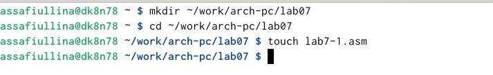{#fig:001 width=70%}

1.2 Инструкция jmp в NASM используется для реализации безусловных переходов. Рассмотрим пример программы с использованием инструкции jmp. Введем в файл lab7-1.asm текст программы из листинга 7.1.

(рис. [-@fig:002])

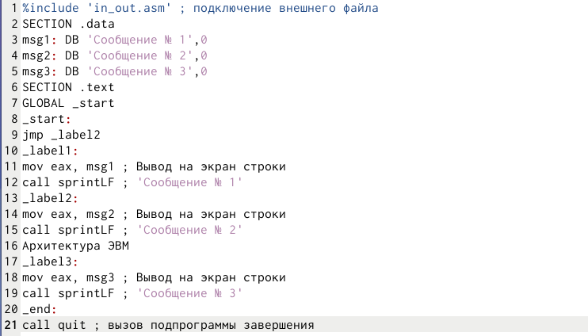{#fig:002 width=70%}

2. Изучение структуры файлов листинга

2.1 создадим исполняемый файл и проверим его работу.

(рис. [-@fig:003])

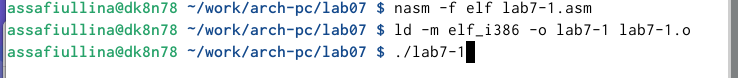{#fig:003 width=70%}

2.2 сравним результат работы данной программы с приведенным в методическом пособии

(рис. [-@fig:004])

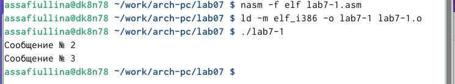{#fig:004 width=70%}

2.3 использование инструкции jmp _label2 меняет порядок исполнения инструкций и позволяет выполнить инструкции начиная с метки _label2, пропустив вывод первого сообщения.
Инструкция jmp позволяет осуществлять переходы не только вперед но и назад. Изменим программу таким образом, чтобы она выводила сначала ‘Сообщение № 2’, потом ‘Сообщение № 1’ и завершала работу. Для этого в текст программы после вывода сообщения № 2 добавим инструкцию jmp с меткой _label1 (т.е. переход к инструкциям вывода сообщения № 1) и после вывода сообщения № 1 добавим инструкцию jmp с меткой _end (т.е. переход к инструкции call quit). Изменим текст программы в соответствии с листингом 7.2.

(рис. [-@fig:005])

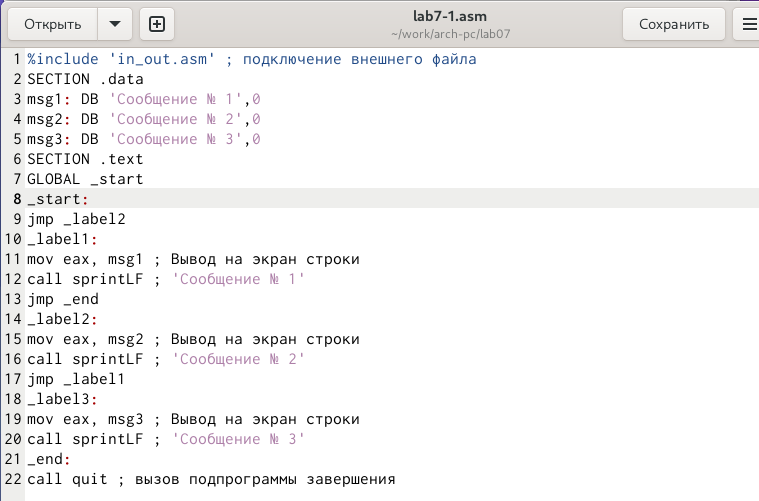{#fig:005 width=70%}

2.4 создадим исполняемый файл и проверим его работу

(рис. [-@fig:006])

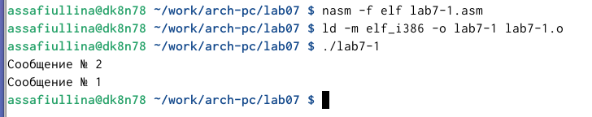{#fig:006 width=70%}

2.5 Изменим текст программы добавив или изменив инструкции jmp, чтобы вывод программы был следующим:

assafiullina@dk8n78:~$ ./lab7-1
Сообщение № 3
Сообщение № 2
Сообщение № 1
assafiullina@dk8n78:~$

для этого в 9 строке заменим jmp _label2 на jmp _label3

(рис. [-@fig:007])

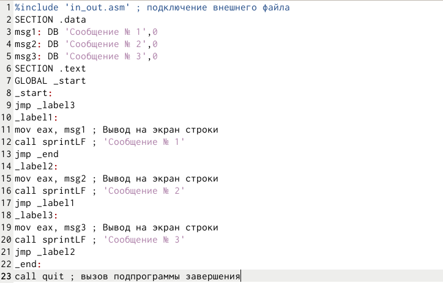{#fig:007 width=70%}

2.6 проверим, соответствует ли результат нашей программы заданному условию, создав исполняемый файл

(рис. [-@fig:008])

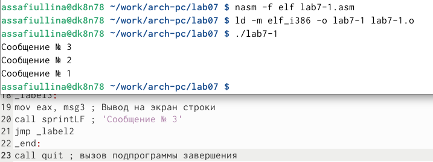{#fig:008 width=70%}

2.7 Создадим файл lab7-2.asm в каталоге ~/work/arch-pc/lab07.

(рис. [-@fig:009])

{#fig:009 width=70%}

2.8 Изучим текст программы из листинга 7.3 и введите в lab7-2.asm.

(рис. [-@fig:010])

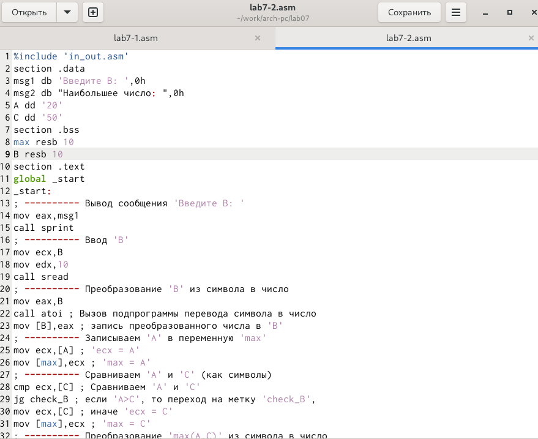{#fig:010 width=70%}

2.9 создадим исполняемый файл и проверим его работу для разных значений

(рис. [-@fig:011])

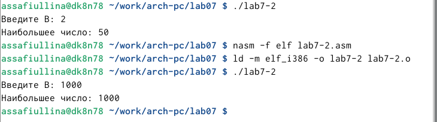{#fig:011 width=70%}

2.10 Обычно nasm создаёт в результате ассемблирования только объектный файл. Получить файл листинга можно, указав ключ -l и задав имя файла листинга в командной строке.
Создадим файл листинга для программы из файла lab7-2.asm

(рис. [-@fig:012])

{#fig:012 width=70%}

2.11 Откроем файл листинга lab7-2.lst с помощью текстового редактора, mcedit: mcedit lab7-2.lst

(рис. [-@fig:013])

{#fig:013 width=70%}

2.12 Откроем файл с программой lab7-2.asm и удалим один операнд - max в строчке 38. Выполним трансляцию с получением файла листинга:
nasm -f elf -l lab7-2.lst lab7-2.asm

(рис. [-@fig:014])

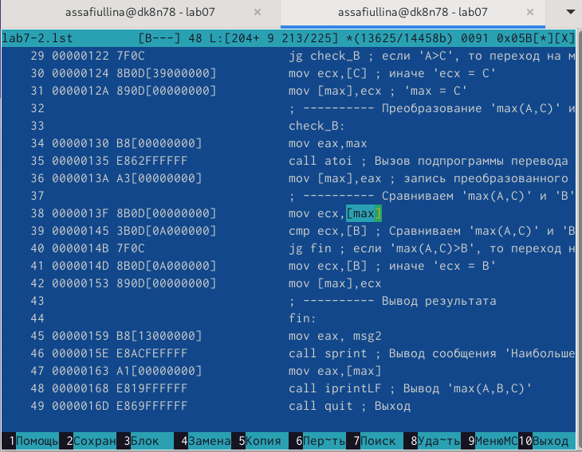{#fig:014 width=70%}

3. Задание для самостоятельной работы

3.1.1 Напишите программу нахождения наименьшей из 3 целочисленных переменных 𝑎,𝑏 и .
Значения переменных выбрать из табл. 7.5 в соответствии с вариантом, полученным
при выполнении лабораторной работы № 7.

(рис. [-@fig:015])

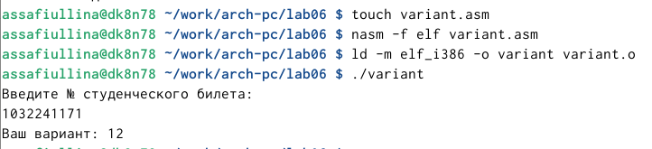{#fig:015 width=70%}

(рис. [-@fig:016])

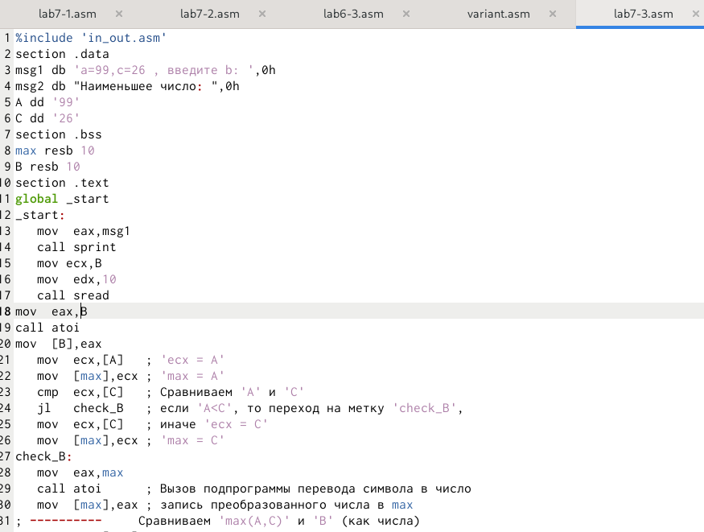{#fig:016 width=70%}

3.1.2 Создадим исполняемый файл и проверим его работу.

(рис. [-@fig:017])

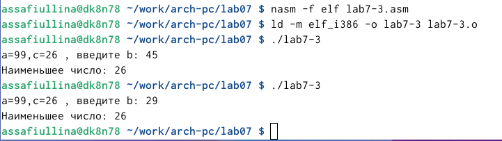{#fig:017 width=70%}

3.2.1 Напишем программу, которая для введенных с клавиатуры значений 𝑥 и 𝑎 вычисляет значение заданной функции 𝑓(𝑥) и выводит результат вычислений. Вид функции 𝑓(𝑥) выберем из таблицы 7.6 вариантов заданий в соответствии с вариантом (12), полученным при выполнении лабораторной работы №6. 

(рис. [-@fig:018])

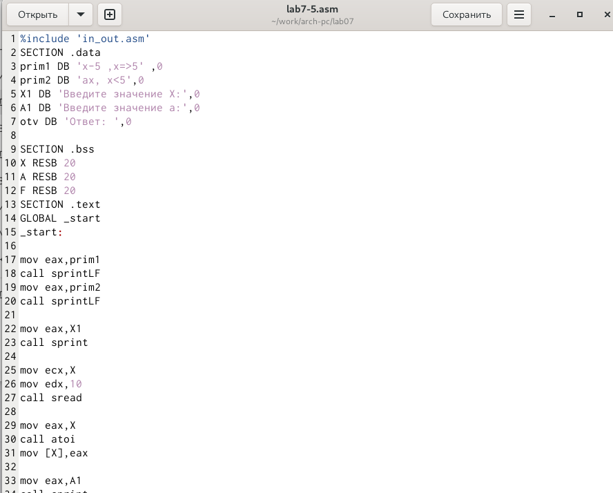{#fig:018 width=70%}

3.2.2 Создадим исполняемый файл и проверьте его работу для значений 𝑥 и 𝑎 из 7.6.

(рис. [-@fig:019])

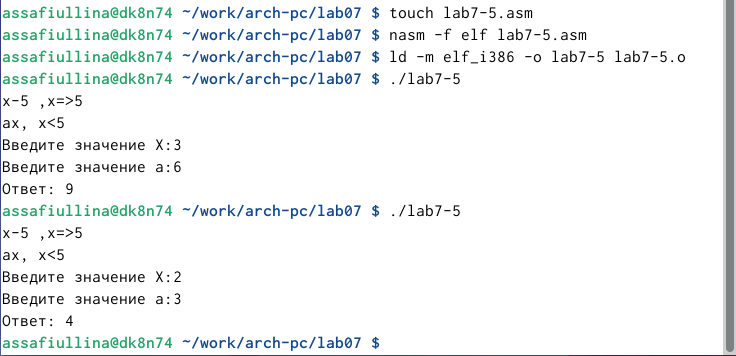{#fig:019 width=70%}

# Выводы

В ходе данной лабораторной работы мы изучили команды условного и безусловного переходов. Приобрели навыки написания программ с использованием переходов. Познакомились с назначением и структурой файла
листинга. А также выполнили задания для самостоятельной работы.

# Список литературы{.unnumbered}

::: {#refs}
:::
