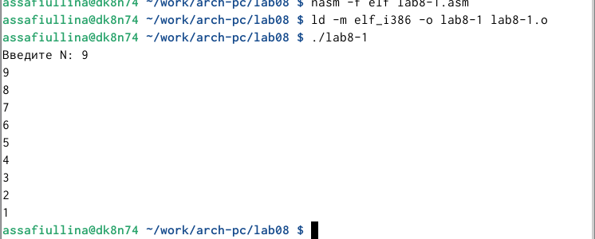
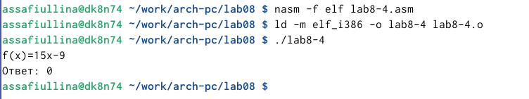

---
## Front matter
title: "Лабораторная работа №8"
subtitle: "Архитектура компьютера.Программирование цикла.Обработка аргументов командной строки"
author: "Сафиуллина Айлина Саяровна"

## Generic otions
lang: ru-RU
toc-title: "Содержание"

## Bibliography
bibliography: bib/cite.bib
csl: pandoc/csl/gost-r-7-0-5-2008-numeric.csl

## Pdf output format
toc: true # Table of contents
toc-depth: 2
lof: true # List of figures
lot: true # List of tables
fontsize: 12pt
linestretch: 1.5
papersize: a4
documentclass: scrreprt
## I18n polyglossia
polyglossia-lang:
  name: russian
  options:
	- spelling=modern
	- babelshorthands=true
polyglossia-otherlangs:
  name: english
## I18n babel
babel-lang: russian
babel-otherlangs: english
## Fonts
mainfont: IBM Plex Serif
romanfont: IBM Plex Serif
sansfont: IBM Plex Sans
monofont: IBM Plex Mono
mathfont: STIX Two Math
mainfontoptions: Ligatures=Common,Ligatures=TeX,Scale=0.94
romanfontoptions: Ligatures=Common,Ligatures=TeX,Scale=0.94
sansfontoptions: Ligatures=Common,Ligatures=TeX,Scale=MatchLowercase,Scale=0.94
monofontoptions: Scale=MatchLowercase,Scale=0.94,FakeStretch=0.9
mathfontoptions:
## Biblatex
biblatex: true
biblio-style: "gost-numeric"
biblatexoptions:
  - parentracker=true
  - backend=biber
  - hyperref=auto
  - language=auto
  - autolang=other*
  - citestyle=gost-numeric
## Pandoc-crossref LaTeX customization
figureTitle: "Рис."
tableTitle: "Таблица"
listingTitle: "Листинг"
lofTitle: "Список иллюстраций"
lotTitle: "Список таблиц"
lolTitle: "Листинги"
## Misc options
indent: true
header-includes:
  - \usepackage{indentfirst}
  - \usepackage{float} # keep figures where there are in the text
  - \floatplacement{figure}{H} # keep figures where there are in the text
---

# Цель работы

Приобретение навыков написания программ с использованием циклов и обработкой аргументов командной строки.

# Задание

1. Реализация циклов в NASM
2. Обработка аргументов командной строки
3. Задание для самостоятельной работы

# Теоретическое введение

Стек — это структура данных, организованная по принципу LIFO («Last In — First Out» или «последним пришёл — первым ушёл»). Стек является частью архитектуры процессора и реализован на аппаратном уровне. Для работы со стеком в процессоре есть специальные регистры (ss, bp, sp) и команды.
Основной функцией стека является функция сохранения адресов возврата и передачи
аргументов при вызове процедур. Кроме того, в нём выделяется память для локальных
переменных и могут временно храниться значения регистров.
Стек имеет вершину, адрес последнего добавленного элемента, который хранится в регистре esp (указатель стека). Противоположный конец стека называется дном. Значение,помещённое в стек последним, извлекается первым. При помещении значения в стек указатель стека уменьшается, а при извлечении — увеличивается.
Для стека существует две основные операции:
• добавление элемента в вершину стека (push);
• извлечение элемента из вершины стека (pop).

Команда push размещает значение в стеке, т.е.помещает значение в ячейку памяти, на которую указывает регистр esp, после этого значение регистра esp увеличивается на 4. Данная команда имеет один операнд-значение, которое необходимо поместить в стек.
Команда pop извлекает значение из стека, т.е. извлекает значение из ячейки памяти, на которую указывает регистр esp, после этого уменьшает значение регистра esp на 4. У этой команды также один операнд, который может быть регистром или переменной в памяти.
Аналогично команде записи в стек существует команда popa, которая восстанавливает из стека все регистры общего назначения, и команда popf для перемещения значений из вершины стека в регистр флагов. Для организации циклов существуют специальные инструкции. Для
всех инструкций максимальное количество проходов задаётся в регистре ecx. Наиболее простой является инструкция loop. Она позволяет организовать безусловный цикл. Иструкция loop выполняется в два этапа.Сначала из регистра ecx вычитается единица и его значение сравнивается с нулём. Если регистр не равен нулю, то выполняется переход к указанной метке. Иначе переход не выполняется и управление передаётся команде, которая следует сразу после команды loop.

# Выполнение лабораторной работы

1. Реализация циклов в NASM 

Создадим каталог для программ лабораторной работы №8, перейдем
в него и создадим файл lab8-1.asm (рис. [-@fig:001]).

{#fig:001 width=100%}

При реализации циклов в NASM с использованием инструкции loop необходимо помнить о том, что эта инструкция использует регистр ecx в качестве счетчика и на каждом шаге уменьшает его значение на единицу.
Введем в файл lab8-1.asm текст программы из листинга 8.1. (рис. [-@fig:002]).

{#fig:002 width=100%}

Создадим исполняемый файл и проверим его работу (рис. [-@fig:003]).

{#fig:003 width=100%}

Данный пример показывает, что использование регистра ecx в теле цилка loop может привести к некорректной работе программы.
Изменим текст программы (рис. [-@fig:004]), добавив изменение значение регистра ecx в цикле:

{#fig:004 width=100%}

Создадим исполняемый файл и запустим его. (рис. [-@fig:005]).

{#fig:005 width=100%}

В результате данных изменений цикл стал бесконечным и закольцованным. 
Далее внесем изменения (рис. [-@fig:006]) в текст программы, добавив команды push и pop для сохранения значения счетчика цикла loop.

{#fig:006 width=100%}

Создадим исполняемый файл и проверим его работу (рис. [-@fig:007])

{#fig:007 width=100%}

После изменений программы число циклов стало соответствовать числу, введенному с клавиатуры. 

2. Обработка аргументов командной строки

 При разработке программ иногда встает необходимость указывать аргументы, которые будут использоваться в программе, непосредственно из командной строки при запуске программы.
 При запуске программы в NASM аргументы командной строки загружаются в стек в обратном порядке, кроме того в стек записывается имя программы и общее количество аргументов.
 Последние два элемента стека для программы, скомпилированной NASM, – это всегда имя программы и количество переданных аргументов.
 Таким образом, для того чтобы использовать аргументы в программе, их просто нужно извлечь из стека. Обработку аргументов нужно проводить в цикле. Т.е. сначала нужно извлечь из стека количество аргументов, а затем циклично для каждого аргумента выполнить логику программы. 
 
Создадим файл  lab8-2.asm (рис. [-@fig:008]) в каталоге ~/work/arch-pc/lab08 и введем в него текст программы из листинга 8.2. (рис. [-@fig:008])

{#fig:008 width=100%}

{#fig:009 width=100%}

Создадим исполняемый файл и запустим его, указав аргументы в строке ./lab8-2 (рис. [-@fig:010])

{#fig:010 width=100%}

Наша программа обработала 4 аргумента - аргумент1, аргумент, 2, 'аргумент 3'

Создадим файл lab8-3.asm (рис. [-@fig:011]) в каталоге ~/work/archpc/lab08 и введем в него текст программы из листинга 8.3 (рис. [-@fig:012])

{#fig:011 width=100%}

{#fig:012 width=100%}

Поменяем текст программы из листинга 8.3, чтобы выводилось произведение аргументов командной строки 

Создадим исполняемый файл и запустим его, указав аргументы (рис. [-@fig:013])

{#fig:013 width=100%}

3. Задание для самостоятельной работы

Создадим файл lab8-4.asm для выполнения самостоятельной работы (рис. [-@fig:014])

{#fig:014 width=100%}

Напишем программу (рис. [-@fig:015]) , которая находит сумму значений функции f(x) для x=x1,x2,…,xn, т.е. программа должна выводить значение f(x1)+f(x2)+…+f(xn). Значения xi передаются как аргументы. Так как у меня вариант 12, моя функция 15x-9.

{#fig:015 width=100%}

Создадим исполняемый файл и проверим его работу на нескольких наборах.(рис. [-@fig:016]), (рис. [-@fig:017]), (рис. [-@fig:018])

{#fig:016 width=100%}

{#fig:017 width=100%}

{#fig:018 width=100%}

# Выводы

В ходе выполнения данной лабораторной работы я приобрела навыки написания программ с использованием циклов NASM и обработкой аргументов командной строки, а так же выполнила задание для самостоятельной работы.

