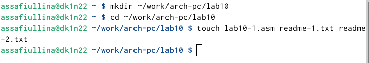
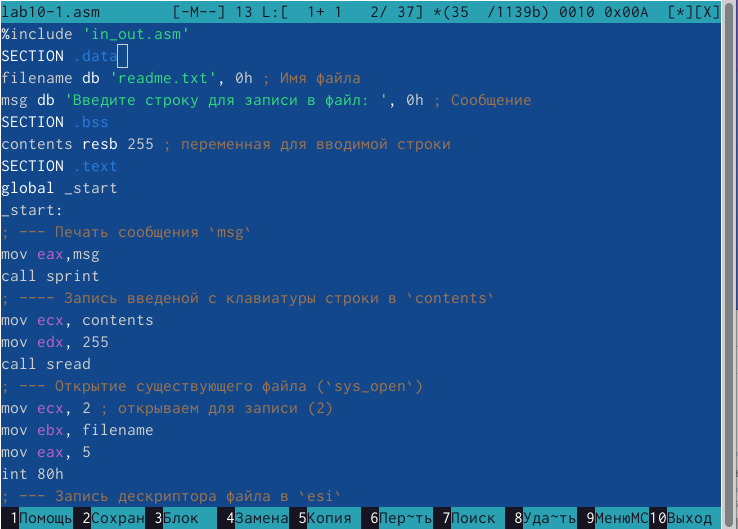
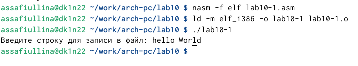
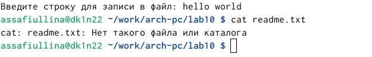
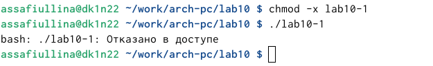
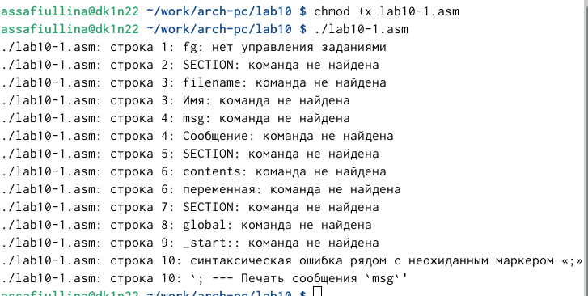
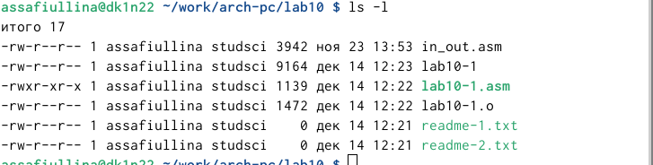
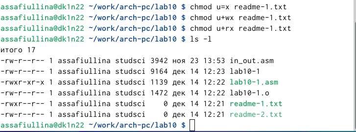
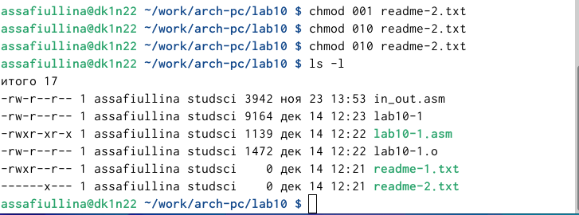
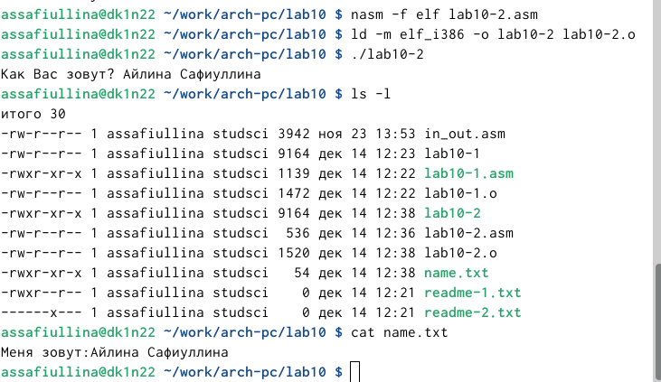

---
## Front matter
title: "Отчет по лабораторной работе №10"
subtitle: "Архитектура компьютера"
author: "Айлина Сафиуллина"

## Generic otions
lang: ru-RU
toc-title: "Содержание"

## Bibliography
bibliography: bib/cite.bib
csl: pandoc/csl/gost-r-7-0-5-2008-numeric.csl

## Pdf output format
toc: true # Table of contents
toc-depth: 2
lof: true # List of figures
lot: true # List of tables
fontsize: 12pt
linestretch: 1.5
papersize: a4
documentclass: scrreprt
## I18n polyglossia
polyglossia-lang:
  name: russian
  options:
	- spelling=modern
	- babelshorthands=true
polyglossia-otherlangs:
  name: english
## I18n babel
babel-lang: russian
babel-otherlangs: english
## Fonts
mainfont: IBM Plex Serif
romanfont: IBM Plex Serif
sansfont: IBM Plex Sans
monofont: IBM Plex Mono
mathfont: STIX Two Math
mainfontoptions: Ligatures=Common,Ligatures=TeX,Scale=0.94
romanfontoptions: Ligatures=Common,Ligatures=TeX,Scale=0.94
sansfontoptions: Ligatures=Common,Ligatures=TeX,Scale=MatchLowercase,Scale=0.94
monofontoptions: Scale=MatchLowercase,Scale=0.94,FakeStretch=0.9
mathfontoptions:
## Biblatex
biblatex: true
biblio-style: "gost-numeric"
biblatexoptions:
  - parentracker=true
  - backend=biber
  - hyperref=auto
  - language=auto
  - autolang=other*
  - citestyle=gost-numeric
## Pandoc-crossref LaTeX customization
figureTitle: "Рис."
tableTitle: "Таблица"
listingTitle: "Листинг"
lofTitle: "Список иллюстраций"
lotTitle: "Список таблиц"
lolTitle: "Листинги"
## Misc options
indent: true
header-includes:
  - \usepackage{indentfirst}
  - \usepackage{float} # keep figures where there are in the text
  - \floatplacement{figure}{H} # keep figures where there are in the text
---

# Цель работы

Приобрести навыки написания программ для работы с файлами.

# Задание

1. Создайте каталог для программам лабораторной работы № 10, перейдите в него и создайте файлы lab10-1.asm, readme-1.txt и readme-2.txt.
2. Введите в файл lab10-1.asm текст программы из листинга 10.1 (Программа записи в файл сообщения). Создайте исполняемый файл и проверьте его работу.
3. С помощью команды chmod измените права доступа к исполняемому файлу lab10-1, запретив его выполнение. Попытайтесь выполнить файл. Объясните результат.
4. С помощью команды chmod измените права доступа к файлу lab10-1.asm с исходным текстом программы, добавив права на исполнение. Попытайтесь выполнить его и объясните результат.
5. В соответствии с вариантом в таблице 10.4 предоставить права доступа к файлу readme-1.txt представленные в символьном виде, а для файла readme-2.txt – в двочном виде. Проверить правильность выполнения с помощью команды ls -l.

# Теоретическое введение

ОС GNU/Linux является многопользовательской операционной системой. И для обеспечения защиты данных одного пользователя от действий других пользователей существуют специальные механизмы разграничения доступа к файлам. Кроме ограничения доступа, данный механизм позволяет разрешить другим пользователям доступ данным для совместной работы. Права доступа определяют набор действий (чтение, запись, выполнение), разрешённых для выполнения пользователям системы над файлами. Для каждого файла пользователь может входить в одну из трех групп: владелец, член группы владельца, все остальные. Для каждой из этих групп может быть установлен свой набор прав доступа. Владельцем файла является его создатель. Для предоставления прав доступа другому пользователю или другой группе командой
chown [ключи] <новый_пользователь>[:новая_группа] <файл>
или
chgrp [ключи] < новая_группа > <файл>
Набор прав доступа задается тройками битов и состоит из прав на чтение, запись и исполнение файла. В символьном представлении он имеет вид строк rwx, где вместо любого символа может стоять дефис. Всего возможно 8 комбинаций, приведенных в таблице 10.1. Буква означает наличие права (установлен в единицу второй бит триады r — чтение, первый бит w — запись, нулевой бит х — исполнение), а дефис означает отсутствие права (нулевое значение соответствующего бита). Также права доступа могут быть представлены как восьмеричное число. Так, права доступа rw- (чтение и запись, без исполнения) понимаются как три двоичные цифры 110 или как восьмеричная цифра 6

# Выполнение лабораторной работы

Я создала каталог для выполнения лабораторной работы №10 и перешла в него (рис. [-@fig:001]).

{#fig:001 width=100%}

В файле lab10-1.asm написала программу из листинга 10.1, которая записывает сообщение в файл. (рис. [-@fig:002]).

{#fig:002 width=100%}

Затем скомпилировала код в исполняемый файл и проверила его работу (рис. [-@fig:003]).

{#fig:003 width=100%}

Программа запрашивает строку и записывает её в файл readme.txt. Если файла не существует, то строка не будет сохранена (рис. [-@fig:004]).

{#fig:004 width=100%}

Чтобы запретить выполнение исполняемого файла lab10-1, использовала команду chmod для изменения прав доступа. Убрала атрибут “x” во всех трёх позициях.
Файл не запускается, так как выполнение запрещено из-за отсутствия атрибута “x” (рис. [-@fig:005]).

{#fig:005 width=100%}

Затем я поменяла права на доступ к файлу lab10-1.asm, добавив разрешение на выполнение с помощью команды chmod. После этого попыталась снова выполнить файл (рис. 4).
Файл запустился, и терминал попытался выполнить его содержимое как команды командной строки. Однако, так как это код на языке ассемблера, а не команды терминала, возникли ошибки. Если же добавить в файл команды командной строки, их можно будет выполнить, запустив файл. (рис. [-@fig:006]).

{#fig:006 width=100%}

(рис. [-@fig:007]).

{#fig:007 width=100%}

Затем я начала выполнять задание в соответствии с моим вариантом -12. Для проверки правильности я использовала команду ls -l. (рис. [-@fig:008]).

{#fig:008 width=100%}

Далее я выполнила задание с двоичным кодом (рис. [-@fig:009]).

{#fig:009 width=100%}

Затем я создала новый файл lab10-2.asm, выполнила задание для самостоятельной работы, целью которого было написание кода, который запрашивает твое имя и вносит его в новый файл, а после с помощью команды cat проверила правильность работы программы.(рис. [-@fig:010]).

{#fig:010 width=100%}

# Выводы

На практике я освоила работу с файлами и управление правами доступа.

